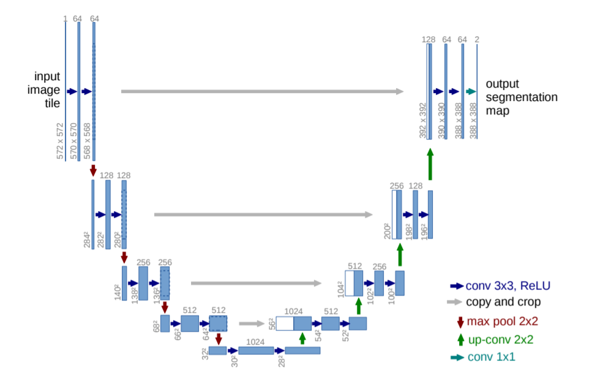

# Unet_jinnan2

An implement of Unet used for competition Jinnan2!

# Architecture

Arxiv PDF: https://arxiv.org/pdf/1505.04597.pdf Here!

orignal architecture:

we modify the output and make all Conv padding as ***"same"*** ,thus ***remove*** the Crop Layer.  

ours architecture will be seen at ***./imgs/Unet_ours.png***  

# Indenpendencies (mainly)  
CUDA : 8.0  
cuDnn: 6.0.21  
tensorflow-gpu : 1.4  
keras : 2.2.4  

**I am so sorry that i can not try my implementation on competition(actrually we use another model), but cause of interest, 
I'll finish the rest of the code.**

# Data processing

